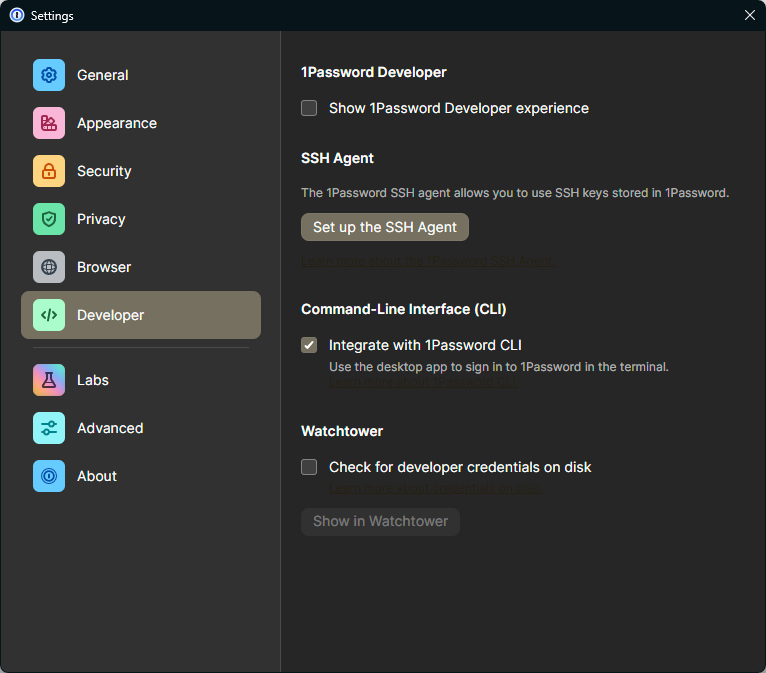
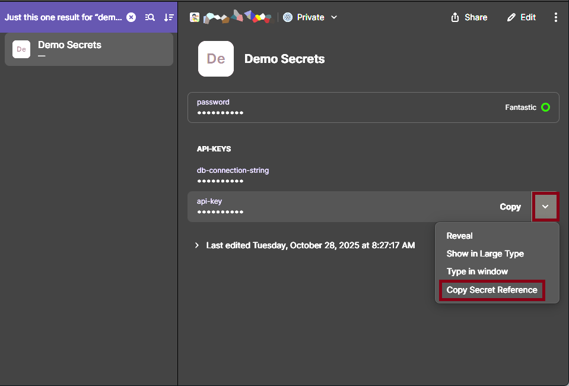

# Claude 1Password Plugin

A Claude Code plugin that manages local `.env` files using secrets stored in 1Password. Keep your secrets secure in 1Password while maintaining a smooth local development workflow.

## Overview

This plugin provides a template-based approach to managing environment variables:

1. Create a `.env.1password` template file with 1Password references
2. Generate your local `.env` file by resolving the references using the 1Password CLI
3. Add a new environment variable to the template, and optionally creates or updates the secret in 1Password

This approach ensures that:
- Secrets are never committed to version control
- Team members can generate their own `.env` files from the shared template
- All secrets are centrally managed in 1Password
- Local development remains simple and seamless

## Prerequisites

- [1Password CLI](https://developer.1password.com/docs/cli/get-started/) installed and configured
- 1Password account with appropriate vault access
- Enable "Integrate with 1Password CLI" in the Developer section of your 1Password Settings
- Authenticated 1Password CLI session (`op signin`)

### Enabling 1Password CLI in Settings



### Getting a 1Password secret URI



## Installation

Install this plugin in Claude Code through the plugin marketplace or by adding it to your `.claude-plugin/marketplace.json` file.

## Commands

This plugin provides three slash commands:

### `/claude-1password:env-init [path-to-env-file]`

Initialize a `.env.1password` template from an (optional) existing `.env` file.

**What it does:**
- Reads your existing `.env` file if it exists
- Converts each variable to use 1Password reference format (`op://vault/item/field`)
- Creates a `.env.1password` template file
- Preserves comments and structure

**How to get 1Password references**


**Example:**
```bash
/claude-1password:env-init
```

**Before** (`.env`):
```env
DATABASE_URL=postgresql://localhost:5432/mydb
API_KEY=abc123secret
```

**After** (`.env.1password`):
```env
# This file was auto-generated from .env.1password
# DO NOT commit this file to version control
# Generated on: 2025-10-28

DATABASE_URL=op://Private/project-secrets/database_url
API_KEY=op://Private/project-secrets/api_key
```

### `/claude-1password:env-sync [path-to-template]`

Generate a `.env` file by resolving 1Password references from your `.env.1password` template.

**What it does:**
- Reads the `.env.1password` template
- Uses `op inject` to resolve all `op://` references
- Fetches actual secret values from 1Password
- Generates your local `.env` file

**Example:**
```bash
/claude-1password:env-sync
```

This command will:
- Check if 1Password CLI is installed and authenticated
- Backup existing `.env` if it exists
- Resolve all secrets from 1Password
- Generate a working `.env` file

### `/claude-1password:env-add <VAR_NAME> [op-reference-or-value]`

Add a new environment variable to your `.env.1password` template.

**What it does:**
- Adds a new variable to the template
- Optionally creates or updates the secret in 1Password
- Maintains the template structure

**Examples:**

Add with an existing 1Password reference:
```bash
/claude-1password:env-add NEW_API_KEY op://Private/myapp/new_api_key
```

Add with a new value (will create in 1Password):
```bash
/claude-1password:env-add STRIPE_KEY sk_test_abc123
```

Add a placeholder for manual editing:
```bash
/claude-1password:env-add DATABASE_PASSWORD
```

## Typical Workflow

### Initial Setup

1. If you have an existing `.env` file:
   ```bash
   /claude-1password:env-init
   ```

2. Edit `.env.1password` to update the `op://` references to match your 1Password vault structure

3. Store your actual secrets in 1Password (manually or using the CLI)

4. Generate your `.env` file:
   ```bash
   /claude-1password:env-sync
   ```

5. Add `.env` to your `.gitignore` (the template will be committed, but not the actual `.env` file)

### Adding New Secrets

When you need a new environment variable:

```bash
/claude-1password:env-add NEW_SECRET_KEY my-secret-value
```

This will:
1. Store the secret in 1Password
2. Update `.env.1password` with the reference
3. Optionally sync to regenerate your `.env` file

### Team Collaboration

Commit the `.env.1password` template to version control:

```bash
git add .env.1password
git commit -m "Add environment variable template"
```

Team members can then generate their own `.env` files:

```bash
/claude-1password:env-sync
```

## How It Works

The plugin uses the [1Password CLI](https://developer.1password.com/docs/cli/) `op inject` command, which:

- Scans files for 1Password secret references in the format `op://vault/item/field`
- Authenticates with your 1Password account
- Fetches the actual secret values
- Replaces references with the decrypted values

Reference format: `op://vault-name/item-name/field-name`

Example:
- `op://Private/myapp/api_key` � resolves to the `api_key` field in the `myapp` item in your Private vault

## Security Best Practices

1. **Never commit** `.env` files to version control
2. **Always commit** `.env.1password` templates (they contain no secrets)
3. **Add to `.gitignore`**:
   ```gitignore
   .env
   .env.local
   .env.*.local
   ```
4. **Use vault permissions** in 1Password to control team access
5. **Rotate secrets regularly** through 1Password
6. **Delete** local `.env` files when not actively developing

## Troubleshooting

### "not signed in" error
Run `op signin` to authenticate with 1Password.

### "item not found" or "vault not found"
Verify that the `op://` references in `.env.1password` match actual items in your 1Password vaults.

### "field not found"
Check that the field name exists in the 1Password item. Field names are case-sensitive.

### CLI not installed
Install the 1Password CLI from: https://developer.1password.com/docs/cli/get-started/

## License

MIT

## Author

Dennis Somerville
densom@users.noreply.github.com
